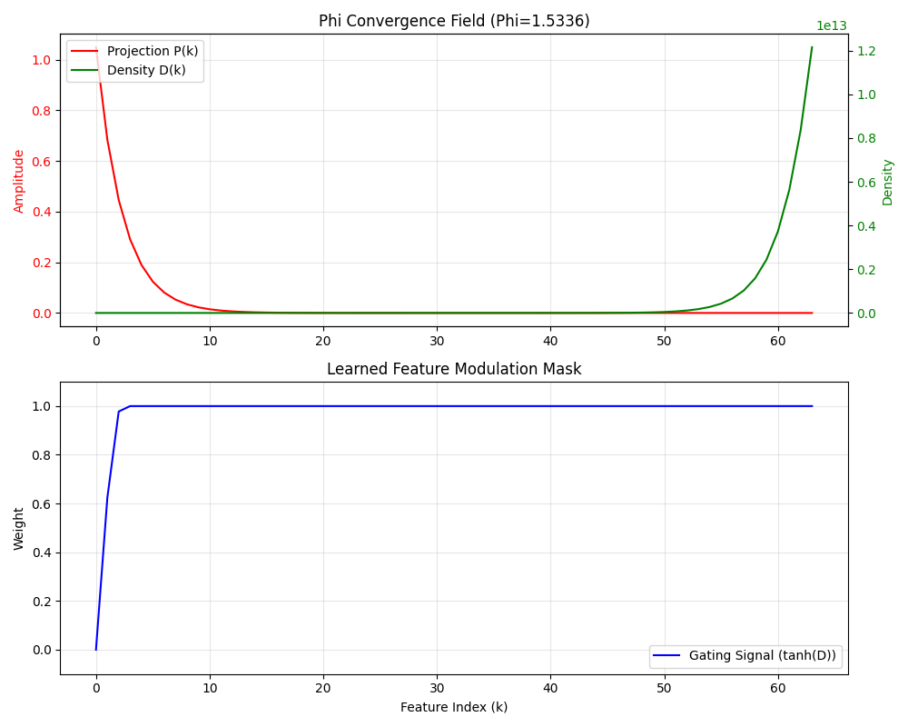

# Repository Synthesis: The Neuro-Symbolic Cognitive Ecosystem

This repository represents a multi-layered, cross-platform architecture designed to model cognitive dynamics, symbolic reasoning, and ontological stability. It integrates high-level neuro-symbolic frameworks with low-level assembly logic and formal mathematical foundations.

## 🏛️ Architectural Layers

### 1. Cognitive & Neuro-Symbolic Layer

The core of the system's reasoning capabilities, blending neural networks with symbolic logic.
- **`empire_silicium_framework.py`**: Integrates symbolic atoms, iterative deliberation, and propositional logic evaluation.
- **`semantic_engine.py`**: A hybrid neuro-symbolic engine that maps words to Cartesian coordinates and applies algebraic rules for meaning expansion.
- **`symbolic_attention.py`**: Implements attention mechanisms over symbolic embeddings defined by algebraic formulas (e.g., functions of N).
- **`antinomy_resolver.py`**: Detects and resolves logical inconsistencies within the symbolic state space.
- **`concept_routing.py`**: Routes tokens based on discursive intent and conceptual cluster similarity.
- **`thought_engine.py`**: Simulates high-level cognitive processes and decision-making cycles.

### 2. Mathematical & Structural Foundation

Provides the formal constraints and geometric structures that govern the cognitive layer.
- **`phi_infinite_line.py` & `phi_analysis.py`**: Explores the golden ratio ($\phi$) as a fundamental scaling factor in structural stability.
- **`polynomial_attention.py`**: Maps token spaces into polynomial domains for dependency-aware canonicalization.
- **`structural_field.py`**: Uses discrete differential operators to extract structural signatures from sequences.
- **`learnable_omega.py`**: Implements the Omega Operator for calculating complex-valued responses from input signals.
- **Haskell Modules (`MultilinearAlgebra/`, `PedersenSchnorr.hs`)**: Provide formal proofs and implementations for multilinear structures and cryptographic primitives.

### 3. Low-Level & Ontological Logic
Implements the "Ontological Processor" logic across various hardware architectures and environments.
- **`assembly/`**:
  - **6502**: Implements stabilization and paradox logic (`estabilizacao.asm`).
  - **dsPIC**: Handles ontological mapping in embedded environments (`MapaOntologico_dsPIC.s`).
  - **x86-64**: High-performance ontological state categorization (`mapa_ontologico_x64_alinhado.asm`).
- **`mapa_ontologico_refinado.js`**: A JavaScript implementation of the core ontological classification logic (Natural vs. Transcendental).
- **`silicium_core.js`**: Manages the fundamental state transitions and parity checks.

### 4. Simulation & Interface Layer

The frontend and simulation environment for visualizing and interacting with the system.
- **`index.html` & `styles.css`**: The primary user interface for the cognitive simulation.
- **`scripts.js`**: Simulates a complex build environment with smart link systems, AES-256-CBC decryption, and terminal logging.
- **`parity_protocol.js`**: Manages communication and synchronization between the simulation components.
- **`thought_radar.html` & `token_graph.html`**: Specialized visualization tools for monitoring system state and token relationships.

## 🔄 System Integration

The ecosystem operates by projecting symbolic intent (Cognitive Layer) through formal mathematical constraints (Foundation Layer), verified against ontological stability criteria (Low-Level Layer), and visualized within a simulated environment (Interface Layer). This multi-disciplinary approach allows for the modeling of complex "CloverPit" dynamics—a debug-grade environment for testing the limits of neuro-symbolic interaction.
